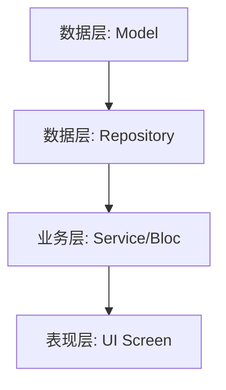

# System Architect Skill (系统架构师)

## 1. 概述

该技能充当 **系统架构师**。它接收经过评审验证的 Rough PRD，将其分解为清晰、原子化的工程任务 (`T-xxx`)，生成 **Manifest 任务清单** 和 **全局架构图**。

**重要规则**: 请全程使用**中文**进行思考和输出。技术术语可保留英文。

## 2. 输入

- **Rough PRD**: `docs/prd/[name]-rough.md`（真理之源）。
- **评审变更日志**: `docs/reviews/[name]/summary.md` §4 变更日志（确保评审修改不丢失）。
- **项目结构**: `lib/` 和 `test/`（必须尊重现有代码模式）。

## 3. 执行步骤

### Step 1: 全局架构设计

- **识别模块**: 本次功能涉及哪些包/模块/层？
- **定义 DAG**: 模块间的依赖关系是什么？（例：数据层 → 业务层 → 表现层）
- **绘制架构图**: 使用 Mermaid `graph TD` 展示技术流向。
- **标注评审变更**: 阅读变更日志，在架构图中标注受评审影响的模块。

### Step 2: 任务原子化

**拆分维度**（按优先级）:
1. **按数据流分层**: Model → Repository → Service/Bloc → UI
2. **层内按功能拆**: 同一层内的独立功能拆为独立任务
3. **跨层聚合**: 若某个功能跨层但改动量小（< 3 文件），可合并为一个任务

**粒度约束**:
| 约束 | 规则 |
|------|------|
| 最小 | > 1 个文件变更（不值得单独拆的归入相邻任务） |
| 最大 | < 1 天工作量（超出则继续拆分） |
| 内聚性 | 单个任务完成后应可独立验证（有明确的验收标准） |

**命名**: `T-{三位数}` (例: `T-001`, `T-002`)

### Step 3: 清单生成

- **创建目录**: `docs/tasks/[feature-id]/`
- **创建 Manifest**: `docs/tasks/[feature-id]/manifest.md`

## 4. 输出格式 (Manifest)

**文件**: `docs/tasks/[feature-id]/manifest.md`

```markdown
# 任务清单: [Feature Name]

> **来源 PRD**: `docs/prd/[name]-rough.md`
> **评审汇总**: `docs/reviews/[name]/summary.md`
> **生成日期**: YYYY-MM-DD

## 1. 架构概览



**受评审影响的模块**:
- [模块名]: [变更日志 Issue 编号，如 I-003]

## 2. 任务列表 (DAG)

- [ ] **T-001: [任务标题]**
  - 路径: `docs/tasks/[feature-id]/sub_prds/[snake_case_name].md`
  - 说明: [任务描述]
  - 依赖: 无
  - 预估工时: [N 小时]
  - 风险等级: 低 / 中 / 高
  - 对应 PRD 章节: §X.X
  - 评审变更引用: [I-XXX 或 无]

- [ ] **T-002: [任务标题]**
  - 路径: `docs/tasks/[feature-id]/sub_prds/[snake_case_name].md`
  - 说明: [任务描述]
  - 依赖: T-001
  - 预估工时: [N 小时]
  - 风险等级: 低 / 中 / 高
  - 对应 PRD 章节: §X.X
  - 评审变更引用: [I-XXX 或 无]

## 3. 风险摘要

| 任务 | 风险等级 | 风险说明 | 缓解措施 |
|------|---------|---------|---------|
| T-00X | 高 | ... | ... |

## 4. 工时汇总

| 任务 | 预估工时 |
|------|---------|
| T-001 | N h |
| T-002 | N h |
| **合计** | **N h** |
```

## 5. 使用示例

**输入**: "用户登录" 功能的 Rough PRD

**输出**: `docs/tasks/login-v1/manifest.md`，包含:
- T-001: 用户数据模型 (Model + Schema 迁移)
- T-002: 认证仓库 (Repository: API + 本地存储)
- T-003: 登录状态管理 (Bloc/Provider)
- T-004: 登录界面 (UI Screen + 表单验证)
