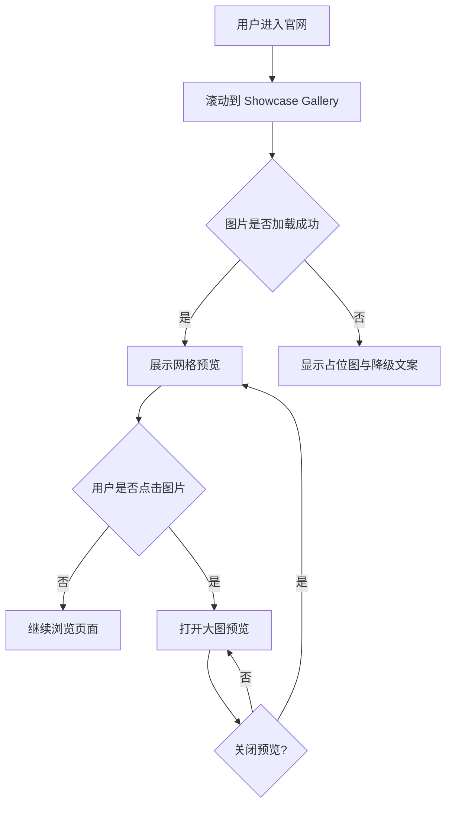

# PRD Draft - Showcase Gallery（Antigravity Website）

## 1. 背景与目标 (Goals)
- 在官网新增 `Showcase Gallery` 展示区，用于集中展示 AgentOS 界面高质量截图。
- 提升访客对产品能力与设计完成度的直观感知，增强品牌信任与转化意愿。
- 作为后续案例内容（新截图、版本迭代）的可维护展示模块。

## 2. 用户故事 (User Stories)
- 作为首次访问官网的潜在用户，我希望快速看到真实产品界面，以判断产品是否专业可用。
- 作为正在评估方案的决策者，我希望通过图片了解核心流程和界面复杂度。
- 作为内容维护者，我希望后续可替换/新增展示图，不影响页面其他模块。

## 3. 核心功能点 (Functional Requirements)
1. 页面新增 `Showcase Gallery` 区块，位于品牌介绍与功能说明之间（可配置）。
2. 支持展示多张高质量图片（首版建议 6-12 张）。
3. 每张图片包含：
   - 预览图
   - 可选标题（如“任务编排面板”）
   - 可选简短说明（1 行）
4. 图片网格自适应：
   - 桌面端多列
   - 移动端单列/双列
5. 点击图片可打开大图预览（Lightbox/Modal）。
6. 图片加载失败时显示占位状态，避免版面塌陷。
7. 区块标题与 CTA 文案可配置（便于 A/B 或文案迭代）。

## 4. 非功能需求 (Non-functional Requirements)
- 性能：
  - 首屏不阻塞，Gallery 图片使用懒加载。
  - 图片资源建议采用压缩格式（如 WebP/AVIF）并提供合理尺寸。
- 可用性：
  - 移动端触控友好，预览层可关闭。
  - 键盘可操作（Esc 关闭预览，Tab 可聚焦）。
- 可维护性：
  - 图片与元数据通过统一配置管理（如 JSON/常量表）。
- 无障碍：
  - 所有图片提供 `alt` 文本。

## 5. 初步流程图 (Mermaid)

## 6. 验收标准 (Acceptance Criteria)
- 官网存在可见的 `Showcase Gallery` 区块，含标题与图片列表。
- 桌面端/移动端布局正常，无明显溢出与错位。
- 点击任意图片可进入并退出大图预览。
- 图片加载失败时有可见占位，不影响整体布局。
- Lighthouse 性能与可访问性无明显回退（相对改动前）。
