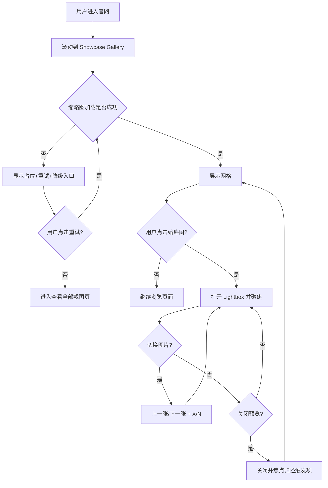

# PRD Final - Showcase Gallery（Antigravity Website）

## 1. 文档定位
- 文档类型：实现级 PRD（修订后可直接开发）
- 目标对象：设计、前端、测试、内容维护
- 修订依据：`review_summary.md` 强制修订清单（Release Gate）

## 2. 背景与目标
- 在官网新增 `Showcase Gallery` 展示区，系统化呈现 AgentOS 高质量界面截图。
- 提升首次访问用户对产品成熟度、可用性与可信度的感知效率。
- 建立可持续内容治理机制，支持后续图片替换与增量发布。

## 3. 术语与范围
- Gallery：截图网格展示区。
- Lightbox：点击缩略图后进入的模态预览层。
- 本期范围（In Scope）：展示区布局、图片预览、键盘与触控交互、失败可恢复、可访问性与性能门槛。
- 非本期范围（Out of Scope）：视频展示、自动轮播、复杂图像编辑能力。

## 4. 信息架构（IA）与位置规则
- 主干默认锚点固定：`价值主张区块之后，功能细节区块之前`。
- 生产主干禁止漂移：不允许在主干环境自由更改 Gallery 位置。
- “可配置位置”仅允许实验分支启用，并需具备显式开关标记。

## 5. 用户故事
- 作为首次访客，我希望快速浏览真实界面，以判断产品是否专业可用。
- 作为评估者，我希望在预览层中连续切换图片，以低摩擦完成比较。
- 作为内容维护者，我希望通过统一清单管理图片与文案，并具备字段校验。

## 6. 功能需求（FR）
### FR-01 区块结构
- 页面新增 `Showcase Gallery` 区块。
- 区块包含：标题、说明（可选）、图片网格、单一主 CTA（可选）。

### FR-02 图片内容模型
- 图片元数据由统一清单管理（JSON/常量表）。
- 必填字段：`url`、`alt`。
- 可选字段：`title`、`description`。
- 约束：
  - 标题长度 `<= 12` 汉字。
  - 说明长度 `<= 24` 汉字。
  - CTA 最多 `1` 个主按钮。

### FR-03 响应式网格
- 桌面端：多列网格（实现可按断点定义 3-4 列）。
- 移动端：单列/双列自适应。
- 网格项在图片未加载完成前保留稳定占位，避免布局跳变。

### FR-04 Lightbox 最小交互闭环（强制）
- 点击缩略图打开 Lightbox，默认显示被点击项。
- 支持 `上一张/下一张` 连续切换。
- 显示当前位置标识：`X/N`。
- 支持关闭方式：遮罩点击关闭、关闭按钮关闭、`Esc` 关闭。
- 键盘支持：`←/→` 切换上一张/下一张。
- 移动端手势优先级：
  - 左右滑动优先触发图片切换。
  - 明确关闭动作（关闭按钮或既定关闭手势）优先于误触。

### FR-05 失败态可恢复机制（强制）
- 失败类型区分：网络失败、资源缺失。
- 失败后提供：
  - `重试` 动作。
  - `查看全部截图页` 降级入口。
- 重试失败时保留降级入口，不中断用户任务路径。

### FR-06 首次使用轻提示
- 首次进入预览层显示轻提示（一次性/短时）：
  - 桌面端：支持方向键切换。
  - 移动端：支持滑动切换。

## 7. 非功能需求（NFR）
### NFR-01 性能
- Gallery 采用懒加载。
- 图片资源优先 WebP（必要时回退兼容格式）。
- 建议提供 `srcset/sizes` 以匹配多分辨率加载策略。
- 相对改动前门槛：
  - `LCP <= 2.5s` 或不回退超过 `10%`。
  - `CLS <= 0.1`。

### NFR-02 可访问性（A11y）
- Lightbox 打开后焦点进入首个可交互元素并锁定于模态内。
- Lightbox 关闭后焦点返回触发的缩略图。
- 语义要求：`aria-modal`、`aria-labelledby`。
- 状态播报要求：
  - 打开时播报“打开第 X 张”。
  - 关闭时播报“已关闭预览”。
- 键盘全流程可达，不得出现焦点丢失。

### NFR-03 可维护性
- 图片清单集中管理并通过字段校验。
- 配置非法（缺失 `url/alt`）时阻断发布或回退到安全降级。

## 8. 交互流程（修订版）

## 9. 验收标准（AC）
### AC-01 主路径一次成功
- 可完成：进入 Gallery -> 打开任意图 -> 连续切换两次 -> 关闭预览 -> 返回原滚动位置。

### AC-02 异常路径可恢复
- 图片加载失败后可执行重试。
- 重试失败仍可通过“查看全部截图页”完成降级访问。
- 全过程网格高度稳定，无明显 CLS 跳变。

### AC-03 可访问性路径可验证
- 键盘可完成打开、切换、关闭全流程。
- 读屏可正确识别模态语义与状态播报。
- 焦点生命周期符合“进入-锁定-归还”规范。

### AC-04 质量阈值
- Lighthouse Accessibility 不低于改动前基线。
- 性能指标满足 NFR-01 量化门槛。

## 10. 实施约束与发布门禁
- 未满足 FR-04、FR-05、NFR-02 任一条，不得进入发布。
- 主干环境不得启用位置漂移实验。
- 内容数据不满足字段约束时，不得发布。

## 11. 里程碑与交付物
- 交付物：
  - 前端实现（Gallery + Lightbox + 失败可恢复）。
  - 配置清单与字段校验。
  - A11y 与性能验证报告（基线对比）。
- 发布判定：满足全部 AC 后进入上线流程。
