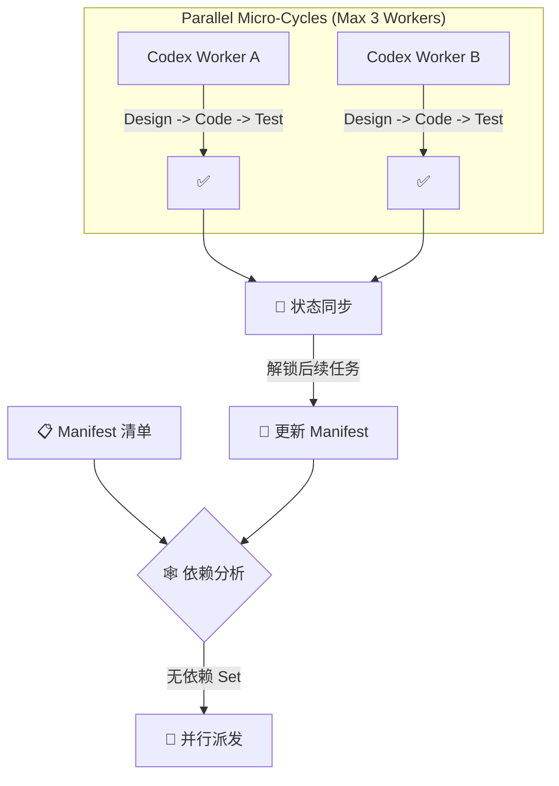

<div align="center">

# 🌌 Antigravity Agent OS

### 给你的 AI 编程助手装上"大脑"

<br/>

**让 AI 不再是金鱼记忆，而是一个越用越聪明的编程搭档。**

<br/>

[](docs/prd/codex-dispatcher-user.md)
[](docs/prd/evolution-engine.md)
[](#-30-秒快速上手)
[](#-适配任何项目)

</div>

---

## 🏁 一键安装

克隆仓库，运行初始化向导——脚本会交互式地帮你配好一切：

```bash
git clone https://github.com/flockmaster/agent-os.git
cd agent-os

# macOS / Linux
bash setup.sh /path/to/your-project

# Windows (PowerShell)
pwsh setup.ps1 -TargetDir "D:\your-project"
```

> 向导会询问你的**项目名称**、**技术栈**和**AI 工具**，然后自动完成：
> - 将 `.agent/` (PM 大脑) 复制到你的项目
> - 将 `.agents/` (Worker 规范) 复制到你的项目 (用于 Codex)
> - 生成定制化的记忆文件与 Git 规则
> - 安装 AI 全局配置 (Gemini/Copilot/Claude)

<details>
<summary>📸 <b>安装向导长什么样？</b>（点击展开）</summary>
<br/>

```
╔══════════════════════════════════════════╗
║   🌌 Antigravity Agent OS — Setup        ║
║   给你的 AI 编程助手装上大脑              ║
╚══════════════════════════════════════════╝

🔧 Step 1/6 — 设置目标项目
   ✅ 目标目录: /Users/dev/my-app

🔧 Step 2/6 — 项目信息
   ✅ 项目: My App | React / TypeScript / Next.js

🔧 Step 3/6 — 选择你的 AI 编程工具
   ✅ AI 工具: GitHub Copilot

🔧 Step 4/6 — 安装 Agent OS 到项目
   ✅ 已复制 .agent/ (Brain)
   ✅ 已复制 .agents/ (Worker Protocols)
   ✅ 已初始化 project_decisions.md
   ✅ 已重置 active_context.md

🔧 Step 5/6 — 安装 AI 全局配置
   ✅ 已配置 ~/.copilot/copilot-instructions.md

╔══════════════════════════════════════════╗
║   🎉 安装完成！                          ║
╚══════════════════════════════════════════╝
   👉 对 AI 说: /start
```

</details>

---

## 😤 痛不痛？

你有没有遇到过这些场景：

| 场景 | 痛感指数 |
|------|:------:|
| 新开一个聊天窗口，又要从头跟 AI 解释项目背景 | 🔥🔥🔥🔥🔥 |
| 让 AI 改完代码，它忘了 commit，你也忘了 | 🔥🔥🔥🔥 |
| 同样的 bug 上周修过一次，今天 AI 又走了一遍弯路 | 🔥🔥🔥🔥🔥 |
| 让 AI 写个功能，写一半停下来问"要继续吗？" | 🔥🔥🔥 |
| PRD 拆了 20 个子任务，在一个窗口做完上下文必爆 | 🔥🔥🔥🔥🔥 |
| AI 每次都像新来的实习生，你是永远的导师 | 🔥🔥🔥🔥🔥 |

> **根本原因：AI Agent 没有记忆，没有流程，没有成长机制。**

Antigravity 就是解决这个问题 —— **一个 `.agent/` 文件夹，给你的 AI 装上大脑。**

---

## 🧠 它能做什么？

<table>
<tr>
<td width="50%">

### 💾 记得住事 (Memory)
AI 终于有了"长短期记忆"，不再每次从零开始。

- 🟢 **项目背景**：架构、技术栈、关键决策，只说一次
- 🟢 **工作进度**：关掉窗口明天接着干，断点续传
- 🟢 **你的偏好**：代码风格、沟通习惯，越用越懂你

</td>
<td width="50%">

### 🧬 学得会 (Evolution)
每完成一个任务，AI 会自动总结经验教训。

- 🟢 **知识积累**：踩过的坑自动记录，绝不踩第二次
- 🟢 **模式识别**：自动发现代码中的通用模板
- 🟢 **效能优化**：追踪工作效率，自动调优流程

</td>
</tr>
<tr>
<td width="50%">

### 🚀 干得完 (Dispatch)
不再"做一步问一步"，而是全自动交付。

- 🟢 **一句话需求** → 自动生成方案 + 写代码 + 测试 + 提交
- 🟢 **并行加速**：同时派发多个相关任务，效率翻倍
- 🟢 **自主闭环**：Manifest 驱动，无需人工介入

</td>
<td width="50%">

### 🔌 搬得走 (Portable)
不绑定任何框架，哪个项目都能用。

- 🟢 **即插即用**：拷贝一个文件夹到项目里就行
- 🟢 **技术无关**：Flutter、React、Python、Go... 全都行
- 🟢 **团队共享**：打包给同事，开箱即用

</td>
</tr>
### 🚨 会报警 (Watchdog)
内存满了自动叫停，防止失忆。

- 🟢 **实时监控**：时刻盯着 Context 消耗
- 🟢 **主动预警**：快满了自动弹窗提示
- 🟢 **一键续命**：输入 `/new` 自动存档并开启新窗口

---

## 🎯 核心架构：Manifest Driven Dispatcher (v4.7)

> **Antigravity v4.7 引入了工业级的分层架构，解决大型任务的上下文爆炸问题。**

### 🏛️ 双层大脑架构
- **.agent/ (PM Brain)**: 你的主对话窗口。负责记忆、规划、发号施令。它知道"要做什么" (User Intent)。
- **.agents/ (Worker Protocol)**: 给 Codex/执行者看的执行规范。它知道"怎么做" (Implementation)。

### 🌊 三阶段流水线 (The Pipeline)

#### Phase 1: 专家评审团 (The Expert Board)
> *Ref: `.agent/skills/ai-expert-review-board/`*

在写第一行代码前，AI 专家团并发对需求进行 360° 体检：
- 🕵️ **产品总监**: 价值评估，拒绝伪需求。
- 👩‍💻 **技术负责人**: 可行性与成本评估。
- 🎨 **体验总监**: 交互流程是否顺畅？
- 🙅 **批判者**: 寻找逻辑漏洞与安全隐患。

#### Phase 2: 任务拆解 (Decomposition)
> *Ref: `.agent/skills/prd-crafter-pro/`*

对于复杂需求，自动拆解为 **原子任务清单 (`manifest.md`)**：
- 🗺️ **业务全景图**: 宏观把控。
- 📋 **Task Manifest**: 详细的子任务列表与依赖关系 (DAG)。
- 📄 **Sub-PRDs**: 每个子任务独立的需求文档。

#### Phase 3: 并行实施 (Parallel Implementation)
> *Ref: `docs/03_Workflow_Implementation.md`*

基于 Manifest 的全自动交付流水线：



---

## ⚡ 30 秒快速上手

**方式一：运行安装向导（推荐）**

```bash
# 向导会交互式引导你完成所有配置
bash setup.sh /path/to/your-project       # macOS / Linux
pwsh setup.ps1 -TargetDir "D:\project"     # Windows
```

**方式二：手动安装**

```bash
# 1️⃣ 把 .agent/ 和 .agents/ 文件夹拷贝到你的项目根目录
cp -r .agent/ /path/to/your-project/
cp -r .agents/ /path/to/your-project/

# 2️⃣ 把安装脚本和 VS Code 配置也带上 (重要!)
cp setup.ps1 setup.sh /path/to/your-project/
cp -r .vscode/ /path/to/your-project/

# 3️⃣ 编辑 .agent/memory/project_decisions.md，填入你的技术栈

# 4️⃣ 在 IDE 中打开项目，对 AI 说：
```

> **你说**：`/start`
> **AI 回**："系统就绪，记忆已加载。请吩咐。"

---

## 🎬 常用指令 (Command Palette)

| 指令 | 说明 | 场景 |
|:---|:---|:---|
| `/start` | **开机** | 刚打开窗口，加载记忆与上下文 |
| `/feature-flow` | **全自动开发** | 从需求描述到代码提交的全流程 |
| `/analyze-error` | **灭火** | 粘贴报错日志，智能分析并修复 |
| `/suspend` | **存档** | 下班/暂停，保存当前状态并生成摘要 |
| `/status` | **看板** | 查看当前任务进度、系统状态 |
| `/evolve` | **进化 v2.0** | 主动巡检代码债、挖掘模式、同步文档 |
| `/reflect` | **复盘** | 总结最近的经验教训，存入长期记忆 |
| `/meta [指令]` | **改系统** | 修改 Agent OS 自身的行为规则 |
| `/export` | **打包** | 导出含安装脚本的系统副本，一键分发 |
| `/rollback` | **后悔药** | 回滚到上一个 Git 检查点 |
| `/knowledge [Q]` | **查知识** | 查询记忆库中的知识点 |
| `/patterns [Q]` | **查模式** | 查询代码复用模式 |

---

## 🗂️ 系统结构一览

```
Project Root/
├── .agent/                      ← PM 大脑 (Your Partner)
│   ├── memory/                  ← 记忆中枢 (Active Context, Project Decisions)
│   ├── workflows/               ← 自动化流程配置 (.md)
│   ├── skills/                  ← 技能插件 (Review Board, PRD Crafter)
│   ├── config/                  ← 系统配置
│   └── adapters/                ← 多模型适配器
│
├── .agents/                     ← Worker 规范 (The Scalable Workforce)
│   ├── memory/                  ← Worker 视角的只读记忆
│   ├── rules/                   ← 编码规范与行为准则
│   └── templates/               ← 代码模板 (e.g. Flutter Advanced)
│
├── docs/                        ← 文档驱动核心
│   ├── 01_Workflow_Expert...    ← 专家评审流程设计
│   ├── 02_Workflow_Task...      ← 任务拆解流程设计
│   └── 03_Workflow_Imple...     ← 实施流程设计
│
└── branding-site/               ← Showcase (Built by Agent OS)
```

---

## 🔌 适配任何项目

Antigravity 与技术栈无关。只需修改一行配置：

```markdown
# .agent/memory/project_decisions.md

Tech Stack: Flutter / Dart / MVVM    ← 改成你的技术栈就行
```

| 已验证 | 理论兼容 |
|:------|:--------|
| **Flutter / Dart** | React / TypeScript |
| **Python / Django** | Vue / Nuxt |
| **Node.js / Express** | Go / Gin |
| **Vanilla HTML/JS** | Rust / Actix |

---

## 🌟 成果展示 (Showcase)

**Agent OS 官网 (Branding Site)** 完全由 Agent OS **v4.7** 自身构建 (Dogfooding)。

- **技术栈**: Vanilla HTML/CSS/JS (零依赖)
- **开发模式**: `Manifest Driven` + `Parallel Dispatch`
- **特性**:
  - 🎨 **Glassmorphism**: 深度玻璃拟态设计体系
  - ⚡ **Performance**: `IntersectionObserver` 驱动的高性能滚动引擎 (Lighthouse 100)
  - 📱 **Responsive**: 完美适配 Mobile (375px) ~ Desktop (1440px)
  - 🖥️ **Visual Terminal**: 模拟 Agent 启动的打字机交互动画

> 👉 **本地查看**: `start branding-site/index.html`

---

## 🤔 常见问题

<details>
<summary><b>Q：这跟直接写 Prompt 有啥区别？</b></summary>
<br/>
Prompt 是"一次性的叮嘱"，关掉窗口就没了。Antigravity 是"持久化的操作系统"——记忆、规则、知识库都存在文件里，AI 每次启动都自动加载。就像给 AI 从"每天新入职"变成"老员工"。
</details>

<details>
<summary><b>Q：.agent 和 .agents 区别是什么？</b></summary>
<br/>
<code>.agent</code> 是给 PM (你当前对话的 AI) 用的，包含高级规划、记忆管理和用户偏好。<code>.agents</code> 是给 Worker (如 Codex 子进程) 用的，包含严格的代码规范、执行协议和只读记忆。这种分离保证了 PM 有大局观，Worker 专注写代码。
</details>

<details>
<summary><b>Q：会不会搞乱我的项目代码？</b></summary>
<br/>
不会。系统所有文件都在 <code>.agent/</code> 和 <code>.agents/</code> 文件夹里，与你的业务代码完全隔离。向导会自动添加 <code>.gitignore</code> 规则，确保动态记忆文件不被误提交。
</details>

<details>
<summary><b>Q：支持哪些 AI 工具？</b></summary>
<br/>
理论上支持所有能读取项目文件的 AI 编程助手。目前深度适配：
<ul>
<li><b>Gemini</b> (Google AI / Android Studio)</li>
<li><b>GitHub Copilot</b> (VS Code / JetBrains)</li>
<li><b>Claude</b> (Anthropic / Cursor)</li>
</ul>
</details>

---

<div align="center">

**⭐ 如果觉得有用，给个 Star 是最大的鼓励**

Made with 🧠 by **Antigravity Systems**

*让每一次对话，都不白聊。*

</div>
