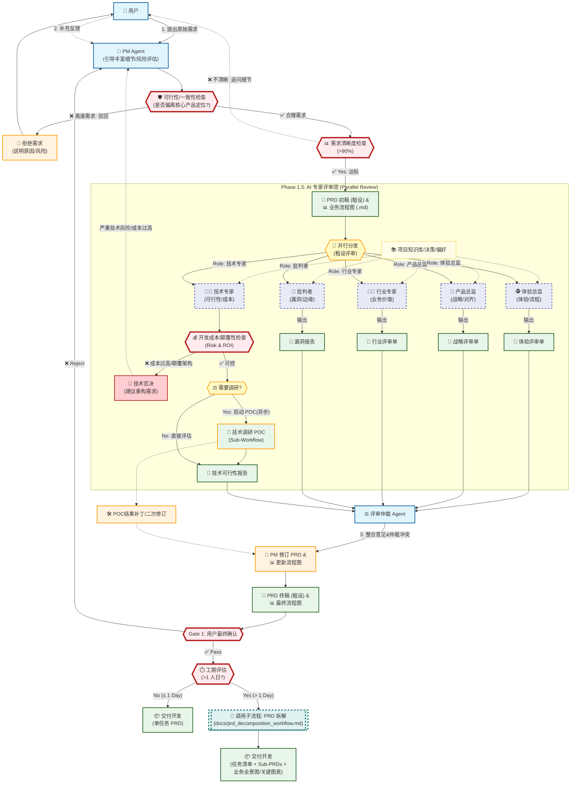

# AI 专家评审团流程图（优化版）

```mermaid
graph TD
    %% 样式定义
    classDef actor fill:#e1f5fe,stroke:#01579b,stroke-width:2px;
    classDef role fill:#e8eaf6,stroke:#3f51b5,stroke-width:2px,stroke-dasharray: 5 5;
    classDef process fill:#fff3e0,stroke:#ff9800,stroke-width:2px;
    classDef gate fill:#ffebee,stroke:#b71c1c,stroke-width:4px;
    classDef artifact fill:#e8f5e9,stroke:#1b5e20,stroke-width:2px;
    classDef memory fill:#fffde7,stroke:#fbc02d,stroke-width:2px,stroke-dasharray: 2 2;

    User["👤 用户"]:::actor --> |"1. 提出原始需求"| PM["🤖 PM Agent<br/>(引导丰富细节/风险评估)"]:::actor
    
    PM --> FeasibilityCheck{{"🛡️ 可行性/一致性检查<br/>(是否偏离核心产品定位?)"}}:::gate
    FeasibilityCheck --> |"❌ 离谱需求: 驳回"| Reject["🚫 拒绝需求<br/>(说明原因/风险)"]:::process
    Reject --> User
    
    FeasibilityCheck --> |"✅ 合理需求"| ClarityCheck{{"📊 需求清晰度检查<br/>(>90%)"}}:::gate
    ClarityCheck -.-> |"❌ 不清晰: 追问细节"| User
    User -.-> |"2. 补充反馈"| PM
    
    ClarityCheck --> |"✅ Yes: 达标"| PRD["📄 PRD 初稿 (粗设) &<br/>📊 业务流程图 (.md)"]:::artifact

    subgraph "Phase 1.5: AI 专家评审团 (Parallel Review)"
        direction TB
        PRD --> Dispatcher{{"🚀 并行分发<br/>(粗设评审)"}}:::process
        
        %% 知识库输入
        Memory["📚 项目知识库/决策/偏好"]:::memory
        Memory -.-> RoleUX
        Memory -.-> RolePD
        Memory -.-> RoleDomain
        Memory -.-> RoleCritic
        Memory -.-> RoleTech

        %% 角色 1: 体验总监
        Dispatcher --> |"Role: 体验总监"| RoleUX["🕵️ 体验总监<br/>(体验/流程)"]:::role
        RoleUX --> |"输出"| ReviewUX["📝 体验评审单"]:::artifact

        %% 角色 1.5: 产品总监
        Dispatcher --> |"Role: 产品总监"| RolePD["👔 产品总监<br/>(战略/对齐)"]:::role
        RolePD --> |"输出"| ReviewPD["📝 战略评审单"]:::artifact
        
        %% 角色 2: 行业专家
        Dispatcher --> |"Role: 行业专家"| RoleDomain["👨‍🏫 行业专家<br/>(业务价值)"]:::role
        RoleDomain --> |"输出"| ReviewDomain["📝 行业评审单"]:::artifact
        
        %% 角色 3: 批判者
        Dispatcher --> |"Role: 批判者"| RoleCritic["🙅 批判者<br/>(漏洞/边缘)"]:::role
        RoleCritic --> |"输出"| ReviewCritic["📝 漏洞报告"]:::artifact
        
        %% 角色 4: 技术专家 (含分支流程)
        Dispatcher --> |"Role: 技术专家"| RoleTech["👨‍💻 技术专家<br/>(可行性/成本)"]:::role
        
        RoleTech --> CostCheck{{"💰 开发成本/颠覆性检查<br/>(Risk & ROI)"}}:::gate
        CostCheck -- "❌ 成本过高/颠覆架构" --> TechReject["🚫 技术否决<br/>(建议重构需求)"]:::process
        
        CostCheck --> |"✅ 可控"| TechCheck{{"⚖️ 需要调研?"}}:::process
        TechCheck --> |"Yes: 启动 POC(异步)"| POC["🔬 技术调研 POC<br/>(Sub-Workflow)"]:::process
        POC --> TechReport["📝 技术可行性报告"]:::artifact
        TechCheck --> |"No: 直接评估"| TechReport
    end

    %% 第一轮汇聚
    ReviewUX --> Aggregator["⚖️ 评审仲裁 Agent"]:::actor
    ReviewPD --> Aggregator
    ReviewDomain --> Aggregator
    ReviewCritic --> Aggregator
    TechReport --> Aggregator

    Aggregator --> |"3. 整合意见&仲裁冲突"| PMFix["🔄 PM 修订 PRD &<br/>📊 更新流程图"]:::process
    PMFix --> FinalArtifacts["📄 PRD 终稿 (粗设) &<br/>📊 最终流程图"]:::artifact
    FinalArtifacts --> Gate1{{"Gate 1: 用户最终确认"}}:::gate
    
    %% Post-Approval: 交付开发准备
    Gate1 --> |"✅ Pass"| WorkloadCheck{{"⏱️ 工期评估<br/>(>1 人日?)"}}:::gate
    
    %% Path A: 小任务直接开发
    WorkloadCheck -- "No (≤ 1 Day)" --> DirectDev["📦 交付开发<br/>(单任务 PRD)"]:::artifact
    
    %% Path B: 大任务进入拆解流程
    WorkloadCheck -- "Yes (> 1 Day)" --> CallSubFlow[["🔗 调用子流程: PRD 拆解<br/>(docs/prd_decomposition_workflow.md)"]]:::subflow
    
    CallSubFlow --> TaskManifest["📦 交付开发<br/>(任务清单 + Sub-PRDs +<br/>业务全景图/关键图表)"]:::artifact

    Gate1 --> |"❌ Reject"| PM
    
    %% 样式 - Subflow
    classDef subflow fill:#e0f2f1,stroke:#00695c,stroke-width:3px,stroke-dasharray: 5 5;

    %% 技术否决回流
    TechReject -.-> |"严重技术风险/成本过高"| PM

    %% 异步 POC补丁流
    POC -.-> AsyncPatch["🛠️ POC结果补丁/二次修订"]:::process
    AsyncPatch -.-> PMFix

    style Dispatcher fill:#fff9c4
    style TechCheck fill:#fff9c4
    style POC fill:#e8f5e9
    style TechReject fill:#ffcdd2,stroke:#b71c1c
    style Memory fill:#fffde7,stroke:#fbc02d,stroke-width:2px,stroke-dasharray: 2 2
```
