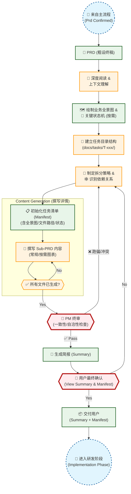
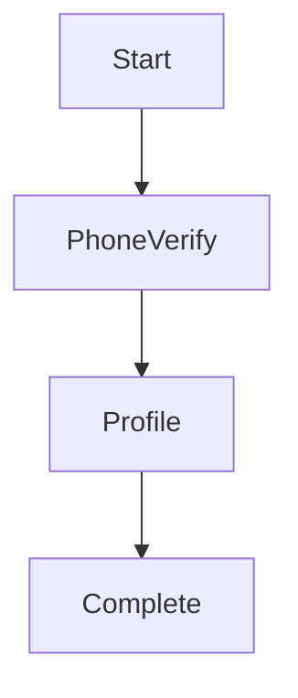

# PRD 复杂度评估与拆解流水线 (Sub-Workflow)

本流程旨在解决大型项目 PRD "粗设" 无法直接指导开发的问题。通过引入工作量评估门禁，将复杂需求拆解为可执行的原子任务单元。

## ✅ 适用场景
- **复杂功能模块**: 涉及多个页面跳转或复杂状态机。
- **跨端协作**: 需要明确的前后端接口定义。
- **大型重构**: 涉及核心架构变更或数据迁移。
- **预估工时**: > 1 人日 (8 小时)。

## 🔄 流程图 (Mermaid)



## 📝 拆解标准与规范

### 1. 拆解维度
- **按技术栈**: 前端 UI / 后端 API / 数据库 Migration
- **按功能模块**: 用户系统 / 订单系统 / 支付网关
- **按依赖关系**: 核心基础层 -> 业务逻辑层 -> UI 表现层 (便于并行)

### 2. 子 PRD 必备要素
每个拆解后的子 PRD (Sub-PRD) 必须包含：
- **目标 (Goal)**: 明确单一职责。
- **状态 (Status)**: `[ ] Pending` / `[x] Done` (用于任务管理)。
- **依赖 (Dependencies)**: 明确前置任务 ID (如: `Pre: T-101`)。
- **输入/输出 (I/O)**: 数据结构定义。
- **流程图/状态机 (Optional)**: 仅当逻辑复杂时提供，简单增删改查可省略。
- **验收标准 (AC)**: Gherkin 格式的测试用例。

### 3. 输出物示例 (Manifest)
```markdown
# Task Manifest: 用户注册模块 (T-100)

## 1. 业务全景图


## 2. 任务列表
- [ ] **T-101: 短信服务接口**
  - Path: `docs/tasks/T-100/sub_prds/sms_service.md`
  - Desc: 对接阿里云短信 API
- [ ] **T-102: 手机号验证 UI**
  - Path: `docs/tasks/T-100/sub_prds/phone_ui.md`
  - Dep: T-101
  - Chart: (见子文档内部)
- [ ] **T-103: 用户资料补全**
  - Path: `docs/tasks/T-100/sub_prds/profile.md`
  - Dep: T-102
```
