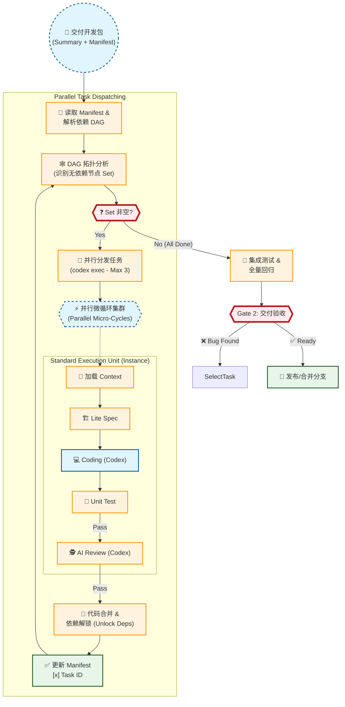

# 研发交付流程图 (Phase 2: R&D Implementation)
该流程基于 CodeBuddy 提效方案与 AgentOS 现状分析 (Gap Analysis) 绘制，承接 Phase 1 之后的技术落地环节。

核心思想：**Manifest 驱动开发的微循环 (Task-Based Micro-Cycles)**。



## 📝 研发执行规范

### 1. 任务调度 (Task Dispatching)
- **DAG 分析**: 系统基于 `manifest.md` 解析任务依赖图。
- **并行分发 (Batch Dispatch)**: 
    -   识别当前所有 `入度=0` (无未完成前置依赖) 且 **互无隐式冲突** 的任务集合。
    -   **Max Limit**: 每次最多并行启动 **3** 个任务。
    -   **执行指令**: 使用 Agent 原生命令启动 Worker:
        ```bash
        codex exec --json --dangerously-bypass-approvals-and-sandbox "{Prompt}"
        ```
- **状态同步**: 任意任务完成 `[x]` 后，重新触发 DAG 分析，解锁新的后续任务。

### 2. 开发微循环 (Micro-Cycle)
每个原子任务 (Task) 必须独立走完以下闭环：

1.  **加载上下文**: 读取该 Task 对应的 `Sub-PRD` 路径及全局全景图。
2.  **Lite Spec**:
    -   不要直接写代码。
    -   先用伪代码或注释定义核心类、接口签名。
3.  **Coding**: 实现业务逻辑。
4.  **Testing & Review**:
    -   编写对应的 Unit Test (Pass Rate 100%)。
    -   通过 AI Review 后方可合并。

### 3. 代码同步与提交
- **分支管理**: 建议每个 Task 在独立 Feature Branch 开发，完成后 Merge 到主开发分支。
- **Commit 规范**: `feat(T-xxx): Summary`。
- **Manifest 更新**: Merge 后立即勾选清单，触发下一轮调度。

### 4. 交付与集成
- **更新 Manifest**: 任务完成后，**必须**将 `manifest.md` 中对应的 Checkbox 打钩 `[x]`。
- **全量回归**: 当 Manifest 中所有 checkbox 均为 `[x]` 时，运行全量测试套件。

### 5. Codex Prompt 规范 (Prompt Template)

PM (Antigravity) 调度 Worker 时，**必须**遵循以下结构化 Prompt 模板：

```markdown
# Role
你是一个资深的全栈工程师 (Senior Full-Stack Engineer)，负责执行原子化任务。

# Task Context
- **Task ID**: {T-xxx}
- **Description**: {One-line description from Manifest}
- **Dependency**: {Pre-requisites completed}

# Input Artifacts (请首先阅读)
1. **Manifest**: `docs/tasks/T-{ID}/manifest.md` (了解全景)
2. **Sub-PRD**: `docs/tasks/T-{ID}/sub_prds/{file}.md` (核心需求)
3. **Global Map**: `docs/tasks/T-{ID}/global_map.mermaid` (如有)

# Constraints (严格遵守)
1. **Scope**: 仅修改 Sub-PRD 要求的代码，**严禁**修改其他模块。
2. **Testing**: 必须编写对应的单元测试，并确保 `Pass Rate 100%`。
3. **Convention**: 遵循项目现有的目录结构和命名规范 (KEBAB-CASE etc.)。
4. **Communication**: 遇到模糊需求，**必须**提问 (Output: QUESTION)，不要通过假设来编码。

# Execution Steps
1. READ input artifacts carefully.
2. DESIGN a lite spec (interfaces/classes) in your mind.
3. CODE the implementation.
4. TEST your code (fix if failed).
5. REVIEW your own code for security/performance.

# Final Output
- Say "TASK {ID} COMPLETED" only when all tests pass.
- List modified files.
```
