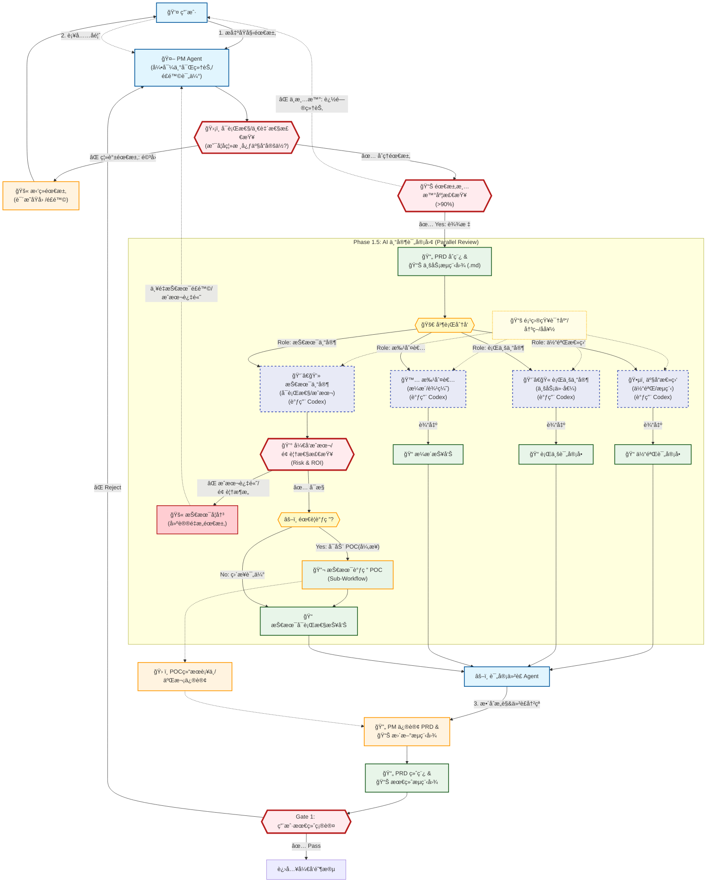

# AI 专家评审团æµç¨‹å›¾ï¼ˆä¼˜åŒ–版）

```mermaid
graph TD
    %% æ ·å¼å®šä¹‰
    classDef actor fill:#e1f5fe,stroke:#01579b,stroke-width:2px;
    classDef role fill:#e8eaf6,stroke:#3f51b5,stroke-width:2px,stroke-dasharray: 5 5;
    classDef process fill:#fff3e0,stroke:#ff9800,stroke-width:2px;
    classDef gate fill:#ffebee,stroke:#b71c1c,stroke-width:4px;
    classDef artifact fill:#e8f5e9,stroke:#1b5e20,stroke-width:2px;
    classDef memory fill:#fffde7,stroke:#fbc02d,stroke-width:2px,stroke-dasharray: 2 2;

    User["👤 用户"]:::actor --> |"1. æ出åŸå§‹éœ€æ±‚"| PM["🤖 PM Agent<br/>(引导丰富细节/é£é™©è¯„ä¼°)"]:::actor
    
    PM --> FeasibilityCheck{{"ğŸ›¡ï¸ å¯è¡Œæ€§/一致性检查<br/>(是å¦å离核心产å“定ä½?)"}}:::gate
    FeasibilityCheck --> |"⌠离谱需求: 驳å›"| Reject["🚫 æ‹’ç»éœ€æ±‚<br/>(说æ˜åŸå› /é£é™©)"]:::process
    Reject --> User
    
    FeasibilityCheck --> |"✅ åˆç†éœ€æ±‚"| ClarityCheck{{"📊 需求清晰度检查<br/>(>90%)"}}:::gate
    ClarityCheck -.-> |"⌠ä¸æ¸…æ™°: 追问细节"| User
    User -.-> |"2. 补充å馈"| PM
    
    ClarityCheck --> |"✅ Yes: 达标"| PRD["📄 PRD åˆç¨¿ &<br/>📊 业务æµç¨‹å›¾ (.md)"]:::artifact

    subgraph "Phase 1.5: AI 专家评审团 (Parallel Review)"
        direction TB
        PRD --> Dispatcher{{"🚀 并行分å‘"}}:::process
        
        %% 知识库输入
        Memory["📚 项目知识库/决策/å好"]:::memory
        Memory -.-> RoleUX
        Memory -.-> RoleDomain
        Memory -.-> RoleCritic
        Memory -.-> RoleTech

        %% 角色 1: 体验总监
        Dispatcher --> |"Role: 体验总监"| RoleUX["ğŸ•µï¸ äº§å“总监<br/>(体验/æµç¨‹)<br/>(调用 Codex)"]:::role
        RoleUX --> |"输出"| ReviewUX["📠体验评审å•"]:::artifact
        
        %% 角色 2: 行业专家
        Dispatcher --> |"Role: 行业专家"| RoleDomain["👨â€ğŸ« 行业专家<br/>(业务价值)<br/>(调用 Codex)"]:::role
        RoleDomain --> |"输出"| ReviewDomain["📠行业评审å•"]:::artifact
        
        %% 角色 3: 批判者
        Dispatcher --> |"Role: 批判者"| RoleCritic["🙅 批判者<br/>(æ¼æ´/边缘)<br/>(调用 Codex)"]:::role
        RoleCritic --> |"输出"| ReviewCritic["📠æ¼æ´æŠ¥å‘Š"]:::artifact
        
        %% 角色 4: 技术专家 (å«åˆ†æ”¯æµç¨‹)
        Dispatcher --> |"Role: 技术专家"| RoleTech["👨â€ğŸ’» 技术专家<br/>(å¯è¡Œæ€§/æˆæœ¬)<br/>(调用 Codex)"]:::role
        
        RoleTech --> CostCheck{{"💰 å¼€å‘æˆæœ¬/颠覆性检查<br/>(Risk & ROI)"}}:::gate
        CostCheck -- "⌠æˆæœ¬è¿‡é«˜/颠覆æ¶æ„" --> TechReject["🚫 技术å¦å†³<br/>(建议é‡æ„需求)"]:::process
        
        CostCheck --> |"✅ å¯æ§"| TechCheck{{"âš–ï¸ éœ€è¦è°ƒç ”?"}}:::process
        TechCheck --> |"Yes: å¯åŠ¨ POC(异步)"| POC["🔬 技术调研 POC<br/>(Sub-Workflow)"]:::process
        POC --> TechReport["📠技术å¯è¡Œæ€§æŠ¥å‘Š"]:::artifact
        TechCheck --> |"No: ç›´æ¥è¯„ä¼°"| TechReport
    end

    %% 第一轮汇èš
    ReviewUX --> Aggregator["âš–ï¸ è¯„å®¡ä»²è£ Agent"]:::actor
    ReviewDomain --> Aggregator
    ReviewCritic --> Aggregator
    TechReport --> Aggregator

    Aggregator --> |"3. æ•´åˆæ„è§&仲è£å†²çª"| PMFix["🔄 PM 修订 PRD &<br/>📊 æ›´æ–°æµç¨‹å›¾"]:::process
    PMFix --> FinalArtifacts["📄 PRD 终稿 &<br/>📊 最终æµç¨‹å›¾"]:::artifact
    FinalArtifacts --> Gate1{{"Gate 1: 用户最终确认"}}:::gate
    
    Gate1 --> |"✅ Pass"| Next["进入开å‘阶段"]
    Gate1 --> |"⌠Reject"| PM

    %% 技术å¦å†³å›æµ
    TechReject -.-> |"严é‡æŠ€æœ¯é£é™©/æˆæœ¬è¿‡é«˜"| PM

    %% 异步 POCè¡¥ä¸æµ
    POC -.-> AsyncPatch["ğŸ› ï¸ POC结æœè¡¥ä¸/二次修订"]:::process
    AsyncPatch -.-> PMFix

    style Dispatcher fill:#fff9c4
    style TechCheck fill:#fff9c4
    style POC fill:#e8f5e9
    style TechReject fill:#ffcdd2,stroke:#b71c1c
    style Memory fill:#fffde7,stroke:#fbc02d,stroke-width:2px,stroke-dasharray: 2 2
```
