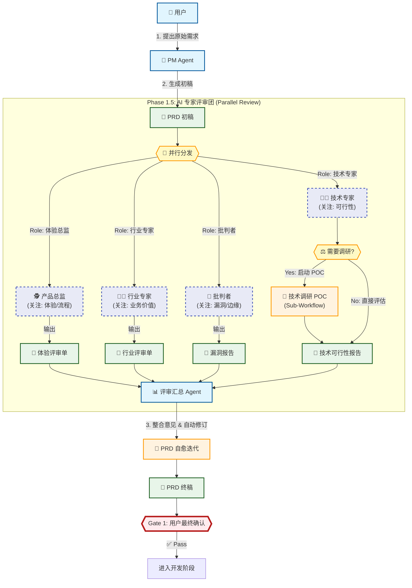

# 腾讯云 CodeBuddy 提效方案与 AgentOS 现状差距分析报告

## 1. 方案核心概览
本文基于《数据万象 + CodeBuddy：从需求到交付 7 步落地》一文，深度解析其“2阶段 + 7步闭环”的研发全流程 AI 提效方案，并对比 AgentOS 当前现状，提出改进建议。

### 核心亮点
*   **全流程覆盖**：不仅仅是代码补全，而是覆盖“需求-设计-编码-测试-评审”全链路。
*   **知识库与规则先行**：强调“基础设施”决定 AI 表现，Project-Specific 的知识库和 Rule 是关键。
*   **Gate 门禁机制**：严格的覆盖率门禁（90%）和 Spec 确认环节。

## 2. 详细差距分析

### 第一阶段：基础设施建设 (Infrastructure)

#### Step 1: 知识库 (Knowledge Base)
*   **CodeBuddy 实践**：
    *   构建项目专属知识库（AI 读取现有代码 + 人工梳理）。
    *   作用：让 AI 理解项目架构、业务名词，避免“幻觉”。
    *   维护：需及时更新，防止误导。
*   **AgentOS 现状**：
    *   已有 `.agents/memory/project_decisions.md` (架构决策) 和 `.agents/memory/knowledge/`。
    *   已有 `.agents/memory/user_preferences.md`。
*   **差距 (Gap)**：
    *   **自动更新机制缺失**：目前依赖 Agent 自行维护或 Evolution Engine (手动触发)，缺乏定期自动扫描代码库更新知识库的机制。
    *   **粒度不够细**：目前偏宏观架构，缺乏具体业务模块的代码级的“地图”。
    *   **Codex 全局感知不足**：Codex 作为执行引擎，默认情况下只会关注当前任务，缺乏对项目整体架构、业务目标及核心决策的全局视角，导致局部最优但全局冲突的代码。
*   **提升方案**：
    *   ✅ **Action**: 建立 `knowledge-refresh` 工作流，定期（如每周）扫描代码结构变化，更新 `architecture_map.md`。
    *   ✅ **Action**: 设计 **Codex 知识体系**，利用 Codex 优先读取根目录 `AGENT.md` (或 `AGENTS.md`) 的特性，将 `project_summary` (项目全貌)、`core_decisions` (核心决策) 及 `critical_rules` (关键规则) 的摘要信息同步写入该文件，使其成为 Codex 的“第一眼上下文”。

#### Step 2: 规则体系 (Rules System)
*   **CodeBuddy 实践**：
    *   分层明确：`WorkflowRules`, `GitBranchRules`, `CodingStandard`, `UnitTestRules` (90%覆盖), `SecurityRules`, `SpecDesignRules`。
    *   强调“可验证”：规则必须能被工具或明确标准检测。
*   **AgentOS 现状**：
    *   已有 `.rules` (文件级) 和 `project_decisions.md` (项目级)。
    *   规则偏向“自然语言指导”，缺乏“机器可验证的硬指标”。
*   **差距 (Gap)**：
    *   **结构化不足**：规则混杂在一起，未按领域（Git, Test, Spec）拆分。
    *   **缺乏硬门禁**：如“单测覆盖率90%”这种硬性指标未在 Prompt 中强制执行，多靠自觉。
*   **提升方案**：
    *   ✅ **Action**: 重构 Rules 目录，参考 CodeBuddy 拆分为：
        *   `rules/git-standards.md`
        *   `rules/testing-gate.md` (定义覆盖率阈值)
        *   `rules/spec-design.md`
    *   ✅ **Action**: 在 Prompt 中引入 Check 步骤，强制检查是否满足 Rules。

---

### 第二阶段：日常研发循环 (Daily Loop)

#### Step 3: 需求 -> 分支 (Req to Branch)
*   **CodeBuddy 实践**：
    *   MCP 联动需求系统 (TAPD)。
    *   自动提取需求 ID 和 Title，生成标准分支名 `feature/xx-v1_desc`。
    *   自动创建分支并回写关联。
*   **AgentOS 现状**：
    *   依赖人工指令 `run /feature-flow`。
    *   分支创建依赖 Agent 自主判断，有时会随意命名。
*   **差距 (Gap)**：
    *   **需求源集成缺失**：目前无法直接读取外部 Issue Tracker。
    *   **自动化程度低**：分支命名规范未强行自动化。
*   **提升方案**：
    *   ✅ **Action**: 定义标准化分支命名 Prompt 模板，输入需求 ID 自动输出标准分支名。

#### Step 4: 方案设计 (Spec / Design)
*   **CodeBuddy 实践**：
    *   **Spec 驱动开发**：写代码前必先生成 Structured Spec 文档。
    *   **Spec 模板**：包含背景、核心流程、数据结构、接口定义、实施计划 (TODOs)。
    *   **人工确认**：Spec 必须经人工确认 (Gate) 才能进入编码。
*   **AgentOS 现状**：
    *   已有 `PRD Crafter` 技能，生成 PRD。
    *   已有 `Gate 1` (等待确认)。
    *   PRD 有时过重，缺乏“技术实现级 Spec” (即直接对应类/函数的蓝图)。
*   **差距 (Gap)**：
    *   **颗粒度差异**：我们现有 PRD 偏产品交互，缺 CodeBuddy 这种“技术方案 Spec”（数据结构、接口签名的伪代码级定义）。
*   **提升方案**：
    *   ✅ **Action**: 增加 `Tech-Spec` 模板，在 PRD 之后、Code 之前，生成一份“技术蓝图”，明确类名、方法名、数据结构。

#### Step 5: 代码实现 (Coding)
*   **CodeBuddy 实践**：
    *   基于 Spec 的 TODO 列表逐一实现。
    *   引用 AI 知识库保持风格一致。
*   **AgentOS 现状**：
    *   Worker Agent 模式已包含此能力，且强制读取 `.preferences`。
    *   **表现良好，差距较小**。

#### Step 6: 单元测试 (Unit Testing)
*   **CodeBuddy 实践**：
    *   **硬指标**：行覆盖率 ≥ 90%。
    *   **循环机制**：生成 -> 跑测 -> 也就是覆盖率报告 -> 未达标 -> 补测 -> 循环。
*   **AgentOS 现状**：
    *   要求“必须自测”，但无覆盖率强制要求。
*   **差距 (Gap)**：
    *   **缺乏测量反馈闭环**：没有强制运行 coverage 工具并根据报告自动补测。
*   **提升方案**：
    *   ✅ **Action**: 引入 Coverage 工具 (如 Flutter 的 `lcov`)，在 Task 结束前强制检查覆盖率文件，低于阈值自动触发“编写更多测试”的任务。

#### Step 7: AI Code Review
*   **CodeBuddy 实践**：
    *   **前置评审**：在人工 Review 之前。
    *   **专用规则**：`AICodeReviewRules`。
    *   **分级报告**：Critical / High / Medium (自动修)。
*   **AgentOS 现状**：
    *   缺乏独立的 Review 环节，通常直接提交。
*   **差距 (Gap)**：
    *   **缺失环节**：Review 环节完全缺失。
*   **提升方案**：
    *   ✅ **Action**: 在 Task 完成后、Git Commit 之前，增加 `pre-commit-review` 步骤，让 Agent 扮演 Reviewer 角色自查 Risk。

## 3. 总结与建议实施路线

我们项目已具备 AgentOS 的强大底座，但在**“工程化约束”**和**“闭环验证”**上不如 CodeBuddy 方案严谨。

### 建议优先落地的 Top 3 改进：
1.  **引入 Tech-Spec 环节**：在写代码前强制生成技术方案文档，而不仅仅是产品需求文档。
2.  **硬化 Unit Test 门禁**：配置测试覆盖率工具，设定最低阈值（如 80%），Agent 必须看到达标报告才能提交。
3.  **结构化 Rules**：将 `.rules` 拆解为可被 Agent 检索的细分规则文件，特别是测试和 Git 规范。

该方案将极大提升我们“一次把事情做对”的概率，减少返工。

## 4. 目标工作流图 (Target Workflow)

```mermaid
graph TD
    %% 样式定义
    classDef actor fill:#e1f5fe,stroke:#01579b,stroke-width:2px;
    classDef memory fill:#fff3e0,stroke:#e65100,stroke-width:2px,stroke-dasharray: 5 5;
    classDef skill fill:#f3e5f5,stroke:#4a148c,stroke-width:2px;
    classDef artifact fill:#e8f5e9,stroke:#1b5e20,stroke-width:2px;
    classDef gate fill:#ffebee,stroke:#b71c1c,stroke-width:4px;
    graph TD
        %% 样式定义
        classDef actor fill:#e1f5fe,stroke:#01579b,stroke-width:2px;
        classDef role fill:#e8eaf6,stroke:#3f51b5,stroke-width:2px,stroke-dasharray: 5 5;
        classDef process fill:#fff3e0,stroke:#ff9800,stroke-width:2px;
        classDef gate fill:#ffebee,stroke:#b71c1c,stroke-width:4px;
        classDef artifact fill:#e8f5e9,stroke:#1b5e20,stroke-width:2px;
    
        User[👤 用户]:::actor --> |"1. 提出原始需求"| PM[🤖 PM Agent]:::actor
        PM --> |"2. 生成初稿"| PRD[📄 PRD 初稿]:::artifact
    
        subgraph "Phase 1.5: AI 专家评审团 (Parallel Review)"
            direction TB
            
            %% 分发中心
            PRD --> Dispatcher{{"🚀 并行分发"}}:::process
            
            %% 角色 1: 体验总监
            Dispatcher --> |"Role: 体验总监"| RoleUX[🕵️ 产品总监<br/>(关注: 体验/流程)]:::role
            RoleUX --> |"输出"| ReviewUX[📝 体验评审单]:::artifact
            
            %% 角色 2: 行业专家
            Dispatcher --> |"Role: 行业专家"| RoleDomain[👨‍🏫 行业专家<br/>(关注: 业务价值)]:::role
            RoleDomain --> |"输出"| ReviewDomain[📝 行业评审单]:::artifact
            
            %% 角色 3: 批判者
            Dispatcher --> |"Role: 批判者"| RoleCritic[🙅 批判者<br/>(关注: 漏洞/边缘)]:::role
            RoleCritic --> |"输出"| ReviewCritic[📝 漏洞报告]:::artifact
            
            %% 角色 4: 技术专家 (含分支流程)
            Dispatcher --> |"Role: 技术专家"| RoleTech[👨‍💻 技术专家<br/>(关注: 可行性)]:::role
            RoleTech --> TechCheck{{"⚖️ 需要调研?"}}:::process
            
            TechCheck --> |"Yes: 启动 POC"| POC[🔬 技术调研 POC<br/>(Sub-Workflow)]:::process
            POC --> TechReport[📝 技术可行性报告]:::artifact
            TechCheck --> |"No: 直接评估"| TechReport
            
            %% 汇聚点
            ReviewUX --> Aggregator[📊 评审汇总 Agent]:::actor
            ReviewDomain --> Aggregator
            ReviewCritic --> Aggregator
            TechReport --> Aggregator
        end
    
        Aggregator --> |"3. 整合意见 & 自动修订"| Optimization[🔄 PRD 自愈迭代]:::process
        Optimization --> FinalPRD[📄 PRD 终稿]:::artifact
        
        FinalPRD --> Gate1{{"Gate 1: 用户最终确认"}}:::gate
        Gate1 --> |"✅ Pass"| Next[进入开发阶段]
    
        style Dispatcher fill:#fff9c4
        style TechCheck fill:#fff9c4    classDef newfeature fill:#e0f7fa,stroke:#006064,stroke-width:3px,stroke-dasharray: 0;

    subgraph "🧠 系统记忆 (增强上下文)"
        Prefs["⚙️ 用户偏好设置<br/>(Preferences)"]:::memory
        Decisions["🏛️ 项目架构决策<br/>(Decisions)"]:::memory
        Details["🗺️ 架构知识库<br/>(自动刷新)"]:::memory-.->|新内容|Decisions
        StructRules["📏 结构化规则库<br/>(Git/测试/方案/安全)"]:::newfeature
    end

    subgraph "Phase 0: 基础设施 (新)"
        Scanner[🔍 知识库扫描器]:::newfeature -.-> |"定期扫描代码"| Details
    end

    User[👤 用户]:::actor --> |"1. 提出需求 /feature-flow"| PMAgent

    subgraph "Phase 1: 规划 & 设计 (设计阶段)"
        PMAgent[🤖 PM Agent]:::actor
        PRDGen[[🛠️ PRD 生成技能]]:::skill
        SpecGen[[🛠️ 技术方案架构师]]:::newfeature

        PMAgent --> PRDGen
        PRDGen --> PRD["📄 产品需求文档 (PRD)"]:::artifact
        PRD --> Gate1{{"Gate 1: 需求确认"}}:::gate
        
        Gate1 --> |"✅ 通过"| SpecGen
        SpecGen -.-> |"遵守"| StructRules
        SpecGen --> TechSpec["📄 技术实施方案 Spec<br/>(类/接口/API定义)"]:::newfeature
        TechSpec --> GateSpec{{"Gate 1.5: 方案确认"}}:::gate
    end

    GateSpec --> |"✅ 通过"| WorkerAgent

    subgraph "Phase 2: 执行 & 闭环 (开发循环)"
        WorkerAgent[👷 Worker Agent]:::actor
        DevTools[[🛠️ 开发工具箱]]:::skill
        
        WorkerAgent -.-> |"遵守"| StructRules
        WorkerAgent --> |"实现 Spec"| DevTools
        DevTools --> Code["💻 源代码文件"]:::artifact
        
        Code --> UnitT[[🧪 单元测试运行器]]:::skill
        UnitT --> CoverCheck{{"🛡️ 覆盖率门禁<br/>(例如 >90%)"}}:::newfeature
        
        CoverCheck --> |"❌ 不达标"| LoopFix[("🔄 自动补写测试")]:::newfeature
        LoopFix --> WorkerAgent
        
        CoverCheck --> |"✅ 达标"| AIReviewer[("🕵️ AI 代码评审")]:::newfeature
        AIReviewer --> |"生成"| ReviewReport["📋 评审报告<br/>(严重/高危/一般)"]:::artifact
    end

    ReviewReport --> GateFinal{{"Gate 2: 最终提交确认"}}:::gate
    GateFinal --> |"✅ 无严重问题"| Commit[Git 提交]:::artifact

    %% 突出显示差异
    style StructRules fill:#b2ebf2
    style Scanner fill:#b2ebf2
    style SpecGen fill:#b2ebf2
    style TechSpec fill:#b2ebf2
    style CoverCheck fill:#b2ebf2
    style LoopFix fill:#b2ebf2
    style AIReviewer fill:#b2ebf2
```

## 5. AI 专家评审团流程图 (AI Expert Review Board)



## 6. 待办事项 / 后续优化 (Backlog)

*   [ ] **Codex 知识体系构建**：建立自动化机制，定期将 `.agents/memory/project_decisions.md` 和 `.agents/memory/user_preferences.md` 的关键摘要同步到根目录 `AGENT.md` (或 `AGENTS.md`) 文件的头部或注释区，解决 Codex 全局感知不足的问题。（优先级：中，后续迭代）
