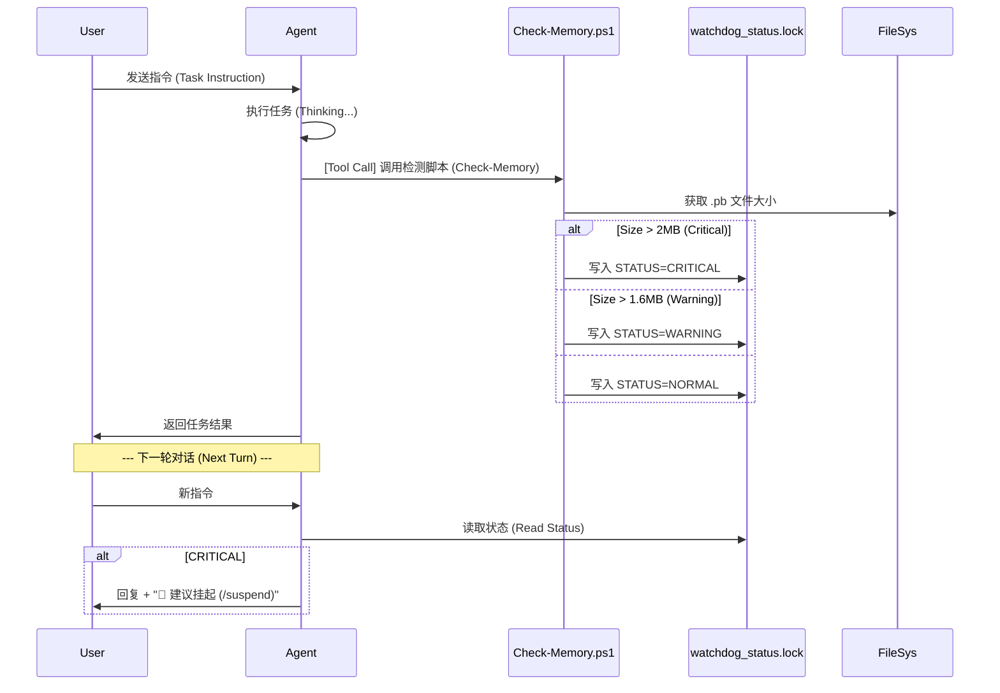

# PRD: Memory Watchdog Lite (v2 - Rough Design)

> **Status**: APPROVED (Rough)
> **Author**: Antigravity Product Design Expert & Review Board
> **Version**: 0.2

## 1. 背景与目标 (Background & Goals)
### 背景
随着对话轮数增加，Agent 的上下文窗口（Context Window）迅速饱和，导致：
1.  **Token 浪费**: 指数级增长的成本。
2.  **智力下降**: 关键指令被淹没（Context Saturation）。
3.  **IDE 卡顿**: 物理内存压力。

### 目标
实现一个**轻量级、非侵入式**的内存监控机制（Memory Watchdog Lite）。
-   **核心指标**: 监控当前会话 `.pb` 文件大小。
-   **反馈方式**: atomic 写入 `.agent/memory/watchdog_status.lock`。
-   **触发时机**: Agent 在回复后（Post-Response Hook）顺手调用检测脚本。

## 2. 核心用户故事 (User Stories)
| 角色 | 目标 | 收益 |
| :--- | :--- | :--- |
| **User (开发者)** | 在对话过程中，自然感知到系统内存压力 | 避免 IDE 突然崩溃，提前规划 `/suspend` 收尾 |
| **Agent (我)** | 在回复后续问题时，自动附带“内存预警” | 表现出更智能、更有生命感的交互体验 |

## 3. 需求规格 (Requirements - MVP)

### 3.1 信号灯文件 (The Signal Flag)
-   **路径**: `.agent/memory/watchdog_status.lock` (原子写入，避免竞态)
-   **格式**: JSON 或 Key-Value。
    ```ini
    STATUS=WARNING
    SIZE=2.5MB
    THRESHOLD=2MB
    TIMESTAMP=1715621234
    SESSION_ID=abc-123
    ```

### 3.2 监控逻辑 (The Watchdog Logic)
-   **脚本**: `Check-Memory.ps1 -SessionId <Guid> -Threshold <MB>`
-   **触发源**: Agent 工具链末尾调用。
-   **阈值策略**:
    -   **Level 1 (Warning)**: > 80% (e.g. 1.6MB) -> 温和提醒。
    -   **Level 2 (Critical)**: > 100% (e.g. 2.0MB) -> 强烈建议中断。

### 3.3 交互体验 (UX)
-   **Level 1 (Warning - 警告)**:
    > **⚠️ Memory Usage: 80% (内存临界)**
    > Pro-tip: 建议尽快完成当前任务并收尾。
    > (Pro-tip: Consider wrapping up this task soon.)

-   **Level 2 (Critical - 严重)**:
    > **🔴 CRITICAL: Context Limit Reached (2.1MB / 2.0MB)**
    > **(上下文已达上限)**
    > 系统性能已降级。请立即保存进度。
    > (System performance is degraded. Please save your progress now.)
    > 
    > **Action**: 输入 `/suspend` 来保存并重置上下文。

## 4. 业务流程 (Business Flow)



## 5. Implementation Notes (实施说明)
- **Concurrency**: 使用 `System.IO.FileMode.OpenOrCreate` with `FileShare.None` 或原子移动 (写临时文件 -> 重命名)。
- **Security**: 验证 `SessionId` 以防止路径遍历攻击。
- **Platform**: PowerShell 脚本必须安全处理 Windows 路径。

## 6. 待办事项 (Out of Scope)
- [ ] **自动清理**: 暂时不自动删除历史记录。
- [ ] **多会话管理**: 当前仅针对 Active Session。
