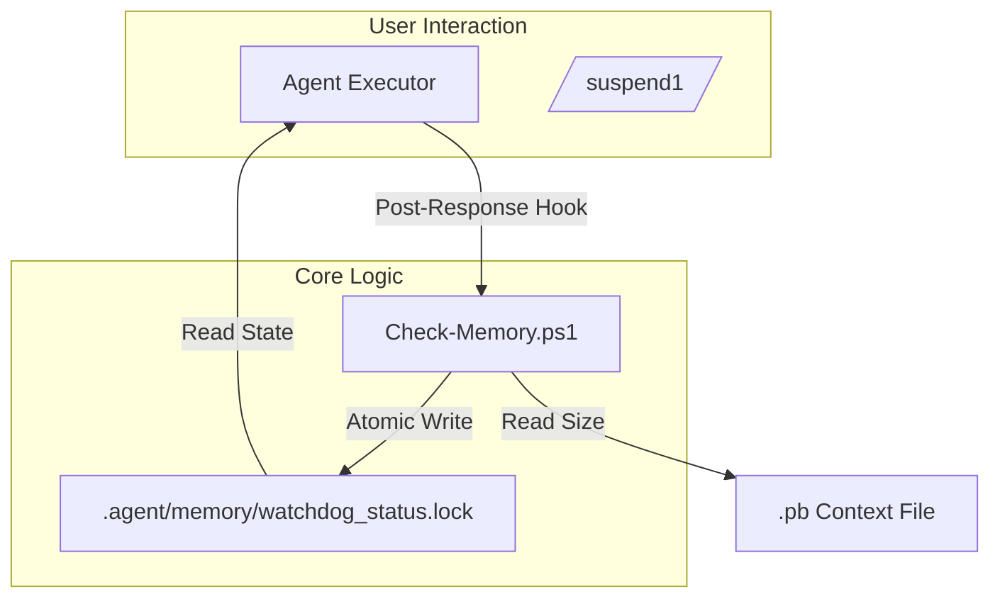

# Task Manifest: Memory Watchdog Lite (v0.2)

## 1. Architecture Map (Global Context)

## 2. Task List (DAG)
> Checklist format. Order implies dependency.

- [x] **[DONE] T-MW-001: Implement Check-Memory Script**
  - Path: `docs/tasks/memory-watchdog-lite/sub_prds/t_mw_001_check_memory_script.md`
  - Context: 开发 PowerShell 脚本，支持 `-SessionId` 和 `-Threshold` 参数，实现双级阈值检测和原子文件写入。
  - Depends On: None

- [x] **[DONE] T-MW-002: Integrate Post-Response Hook**
  - Path: `docs/tasks/memory-watchdog-lite/sub_prds/t_mw_002_post_response_hook.md`
  - Context: 修改 Agent 主循环或工具链配置，在每次回复生成后自动调用 `Check-Memory.ps1`。
  - Depends On: T-MW-001

- [x] **[DONE] T-MW-003: Implement Warning Interaction**
  - Path: `docs/tasks/memory-watchdog-lite/sub_prds/t_mw_003_warning_interaction.md`
  - Context: 在 Agent 启动或任务开始时读取状态文件，若为 WARNING/CRITICAL 则注入提示信息到 System Prompt 或 User Message。
  - Depends On: T-MW-002
